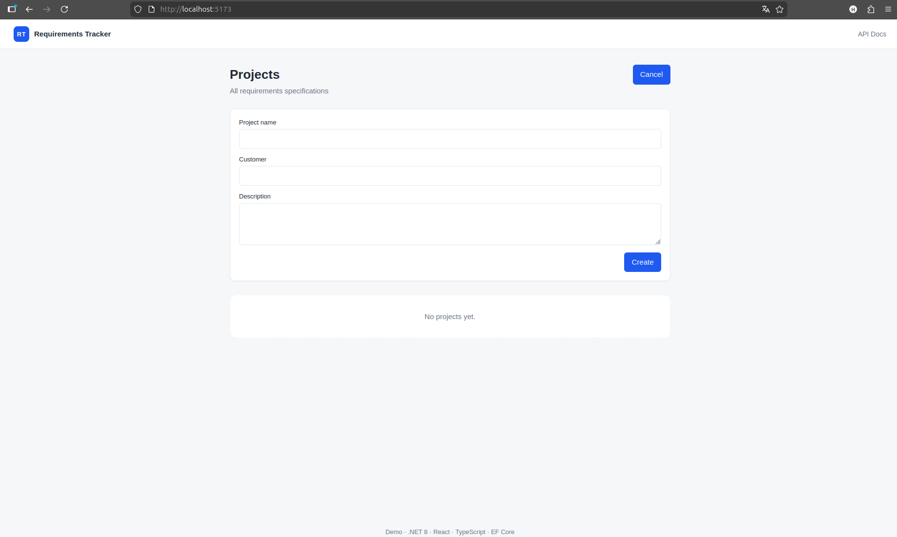
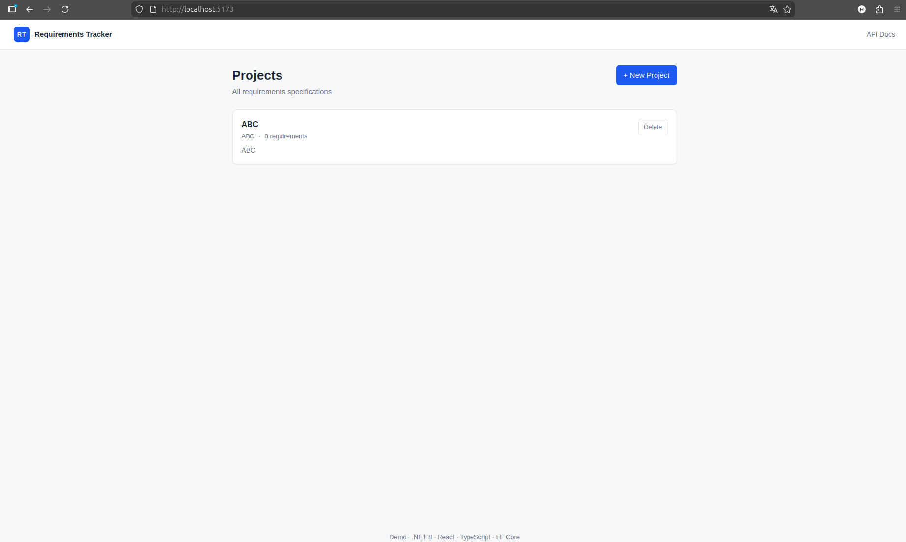
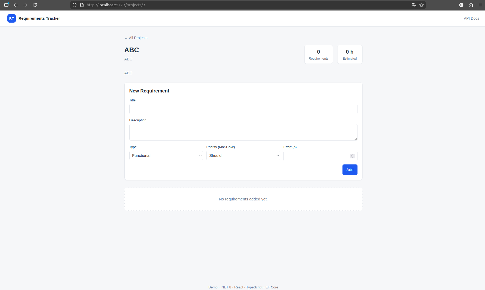

# Requirements Tracker

A full-stack requirements management system built with ASP.NET Core and React.

This application models real-world software engineering workflows, enabling teams to manage project requirements with structured prioritization (MoSCoW), lifecycle status tracking, and effort estimation — all exposed via a clean REST API and a strongly typed frontend.

---

## Key Highlights

- Full-stack architecture with clear separation of concerns (Controllers · DTOs · Domain · UI)
- Strongly typed frontend–backend contract using TypeScript and C# DTOs
- RESTful API design with nested resources and proper HTTP semantics
- Configurable database provider (SQLite ↔ PostgreSQL) without code changes
- Enum serialization as strings for readable APIs and maintainable data models
- Swagger/OpenAPI integration for interactive API exploration
- Environment-based configuration for scalable deployment

---

## Tech Stack

| Layer    | Technology                                     |
|----------|------------------------------------------------|
| Backend  | ASP.NET Core 8 · C# · REST                     |
| ORM      | Entity Framework Core 8                        |
| Database | SQLite (development) · PostgreSQL (production) |
| Frontend | React 18 · TypeScript · Vite                   |
| API Docs | Swagger / OpenAPI                              |

---

## Screenshots
 
### Projects Overview





### Requirements View



---

## Project Structure

```
requirements-tracker/
├── backend/
│   ├── RequirementsTracker.sln
│   └── src/RequirementsTracker.Api/
│       ├── Controllers/      REST endpoints
│       ├── Data/             EF Core DbContext
│       ├── Models/           Domain entities
│       ├── Dtos/             API contracts
│       └── Program.cs        App configuration & DI
└── frontend/
    ├── src/
    │   ├── api/              Typed API client
    │   ├── pages/            Route components
    │   ├── types/            Shared contract models
    │   └── styles.css
    └── vite.config.ts        Dev proxy configuration
```

---

## Quick Start

### Prerequisites

- .NET SDK 8.0 — https://dotnet.microsoft.com/download
- Node.js 18+ — https://nodejs.org

---

### Run Backend

```bash
cd backend/src/RequirementsTracker.Api
dotnet restore
dotnet run
```

- API: http://localhost:5080
- Swagger: http://localhost:5080/swagger

On first run, an SQLite database is created automatically and seeded with demo data.

---

### Run Frontend

```bash
cd frontend
npm install
npm run dev
```

- App: http://localhost:5173

---

## Environment Configuration

Frontend uses environment variables for backend integration.

Create `frontend/.env`:

```env
VITE_API_BASE_URL=http://localhost:5080
```

This enables seamless switching between local and deployed backends without code changes.

---

## API Overview

| Method | Route                                     | Description          |
|--------|-------------------------------------------|----------------------|
| GET    | `/api/projects`                           | List all projects    |
| POST   | `/api/projects`                           | Create a new project |
| GET    | `/api/projects/{id}`                      | Get a project        |
| PUT    | `/api/projects/{id}`                      | Update a project     |
| DELETE | `/api/projects/{id}`                      | Delete project       |
| GET    | `/api/projects/{id}/requirements`         | List requirements    |
| POST   | `/api/projects/{id}/requirements`         | Create requirement   |
| PUT    | `/api/projects/{id}/requirements/{reqId}` | Update requirement   |
| DELETE | `/api/projects/{id}/requirements/{reqId}` | Delete requirement   |

Full interactive API documentation available via Swagger.

---

## Domain Model

**Project** → has many → **Requirement**

Each requirement includes:

- **Type**: Functional · Non-functional
- **Priority (MoSCoW)**: Must · Should · Could · Won't
- **Status**: Draft → Approved → In Progress → Done / Rejected
- **Estimated effort** in hours

---

## Design Decisions

- **DTO-based architecture**
  Strict separation between domain models and API contracts to ensure maintainability and future versioning flexibility.

- **Provider abstraction**
  Database provider is configurable at runtime, enabling seamless switching between SQLite and PostgreSQL.

- **String-based enum serialization**
  Improves API readability and prevents breaking changes when extending enum values.

- **Nested resource structure**
  Requirements are scoped under projects (`/projects/{id}/requirements`) to enforce domain relationships explicitly.

- **Typed frontend integration**
  TypeScript models mirror backend DTOs, reducing runtime errors and improving developer experience.

---


## Future Improvements

- Authentication and authorization (JWT / Identity / OIDC)
- Requirement versioning and audit history
- Export to PDF / DOCX specifications
- Role-based access control
- Unit and integration testing (xUnit)
- Docker-based deployment setup

---


## Motivation

This project was built to simulate a real-world requirements engineering system, focusing on backend architecture, API design, and full-stack integration rather than just UI development.

---

## License

MIT License